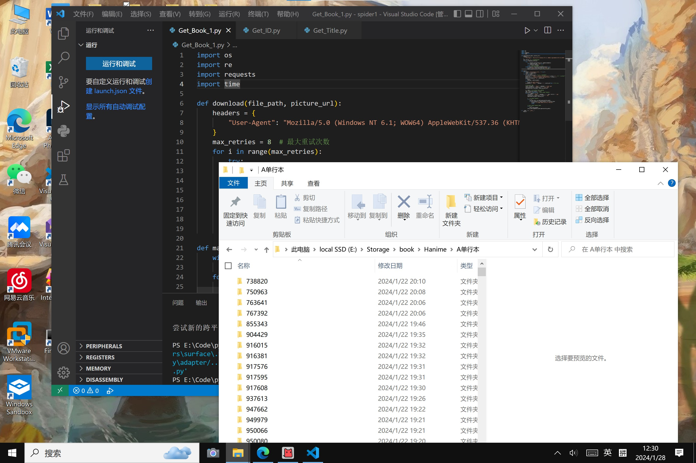

漫画网站（Hanime1.me）的爬虫使用指南

=================

1. 运行 Get_ID 获取 ID
   --------------------
   执行此功能，将会获取漫画网站上所有漫画的 ID，并将其保存在 id.txt 文件中。执行命令如下：
   ```
   python Get_ID.py
   ```

2. 运行 Get_Title 获取标题
   ------------------------
   执行此功能，将会根据先前获取的 ID ，获取每个漫画的标题，并将其保存在 Title.txt 文件中。执行命令如下：
   ```
   python Get_Title.py
   ```

3. 运行 Get_Book 获取主要内容（含封面）
   ---------------------------------
   执行此功能，将会根据先前获取的 ID （即Target.txt），获取每个漫画的主要内容，包括封面图像，并将其保存在相应的文件夹中。执行命令如下：
   ```
   python Get_Book.py
   ```

4. 文件生成和保存
   --------------
   程序运行后，会生成以下文件和文件夹：
   - id.txt：保存所有漫画的 ID。
   - Title.txt：保存所有漫画的标题。
   - Book文件夹：包含每个漫画的主要内容，其中还包括封面图像。
   - 文件夹（除了 Book 内的）：请勿删除或修改这些文件和文件夹。

注意事项：
- 在运行爬虫之前，请确保您已经安装了所需的 Python 环境和相关库(os,re,requests,BeautifulSoup)。
- 请遵守网站的使用规则和法律法规，合法获取漫画内容，避免侵犯版权。
- 请注意爬取速度，避免给网站服务器带来过大的负担。
- 代码与爬取获得的内容仅供学习与参考，未经允许禁止转载。
- 如果您有任何问题或疑问，可以查看源代码或与开发者进行联系。

祝您使用愉快！From：wdx